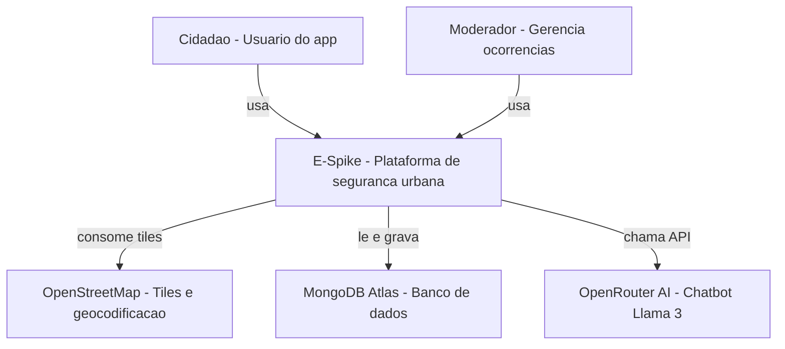
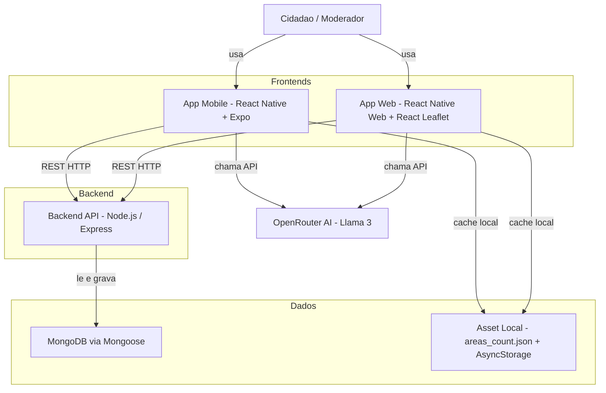
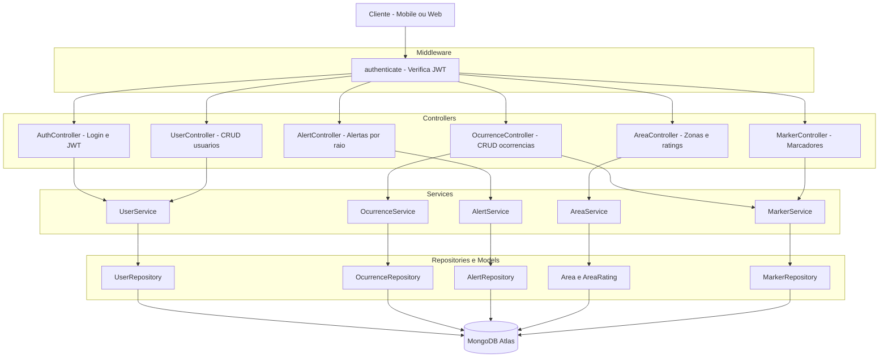
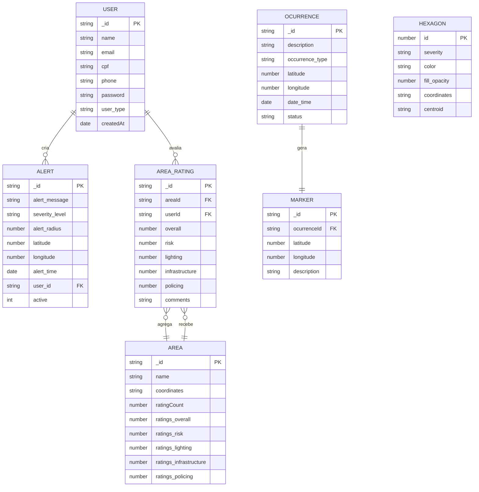

# C4 Model — E-Spike

Documentação arquitetural do projeto E-Spike nos quatro níveis do C4 Model.

---

## Nível 1 — System Context

Visão geral do sistema e seus atores externos.

---

## Nível 2 — Container

Blocos tecnológicos que compõem o E-Spike.

---

## Nível 3 — Component (Backend API)

Componentes internos do Backend Node.js / Express.

---

## Nível 4 — Code (Domain Models)

Entidades do domínio, seus campos e relações.

> **Nota:** `HEXAGON` é uma entidade **local** — carregada do arquivo `assets/areas_count.json` e cacheada via `AsyncStorage`. Não possui relação com o MongoDB nem com as demais entidades.

---

## Resumo das Relações

| Relação               | Tipo    | Descrição                                                   |
| ----------------------- | ------- | ------------------------------------------------------------- |
| `User` → `Alert`       | 1:N     | Usuário cria vários alertas                                 |
| `User` → `AreaRating`  | 1:N     | Usuário avalia várias áreas (upsert por área)             |
| `Ocurrence` → `Marker` | 1:1     | Criados atomicamente; Marker é revertido se Ocurrence falhar |
| `AreaRating` → `Area`  | N:1     | Cada avaliação recalcula as médias em`Area.ratings`        |
| `Hexagon`               | isolado | Dado estático local, sem FK com MongoDB                      |
